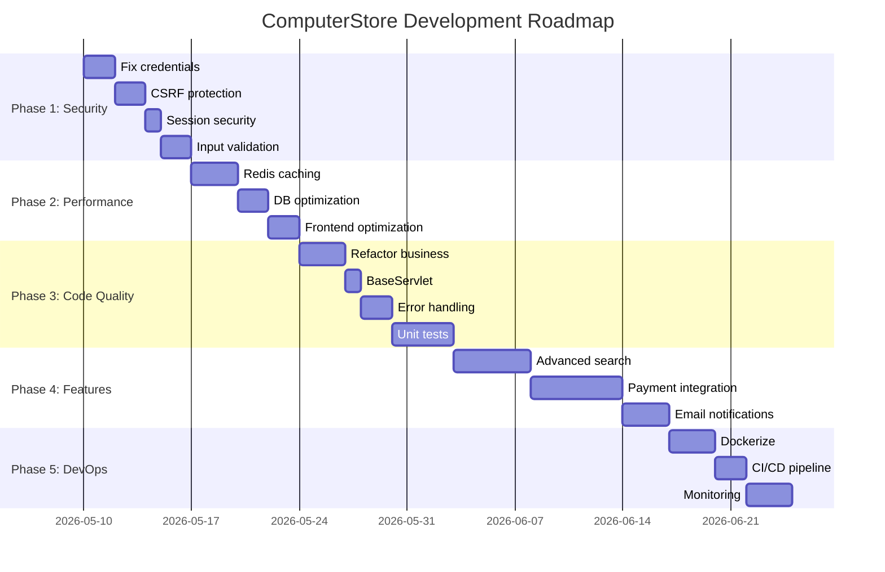

# 🚀 Kế Hoạch Phát Triển và Cải Thiện Hệ Thống ComputerStore

## 📋 Mục Lục

1. [Tổng Quan](#tổng-quan)
2. [Giai Đoạn 1: Bảo Mật](#giai-đoạn-1-cải-thiện-bảo-mật)
3. [Giai Đoạn 2: Performance](#giai-đoạn-2-tối-ưu-performance)
4. [Giai Đoạn 3: Code Quality](#giai-đoạn-3-cải-thiện-code-quality)
5. [Giai Đoạn 4: Tính Năng Mới](#giai-đoạn-4-tính-năng-mới)
6. [Giai Đoạn 5: DevOps](#giai-đoạn-5-scalability--devops)
7. [Roadmap](#roadmap-tổng-quan)
8. [Metrics](#metrics--success-criteria)

---

## Tổng Quan

### Hiện Trạng Hệ Thống

- **Kiến trúc**: 3-tier (Controller-Service-DAO)
- **Công nghệ**: Java 21, Jakarta Servlet, MySQL, JSP
- **Quy mô**: ~60 Java classes, 13 database tables, 14 JSP pages
- **Độ phức tạp**: Medium

### Vấn Đề Chính

1. 🔴 **Security**: Hard-coded credentials, thiếu CSRF, session fixation
2. 🟡 **Performance**: Không caching, N+1 queries, thiếu indexes
3. 🟢 **Code Quality**: Business logic in controller, không có tests, code duplication

---

## Giai Đoạn 1: Cải Thiện Bảo Mật

_Thời gian: 1-2 tuần | Ưu tiên: P0 (Critical)_

### ✅ Task 1.1: Loại Bỏ Hard-coded Credentials

**File cần sửa**: `src/main/java/com/computerstore/utils/DBConnection.java`

**Hiện trạng**:

```java
config.setUsername("root");
config.setPassword("123456");
```

**Giải pháp**:

1. Tạo file `.env` (đã có, cần cập nhật):

```properties
DB_HOST=localhost
DB_PORT=3306
DB_NAME=ComputerSpace
DB_USERNAME=root
DB_PASSWORD=your_secure_password
```

2. Cập nhật `DBConnection.java`:

```java
public class DBConnection {
    private static HikariDataSource dataSource;

    static {
        try {
            // Đọc từ environment variables
            String dbHost = System.getenv("DB_HOST");
            String dbPort = System.getenv("DB_PORT");
            String dbName = System.getenv("DB_NAME");
            String dbUsername = System.getenv("DB_USERNAME");
            String dbPassword = System.getenv("DB_PASSWORD");

            // Fallback to .env file nếu không có env vars
            if (dbHost == null) {
                Properties props = loadEnvFile();
                dbHost = props.getProperty("DB_HOST", "localhost");
                dbPort = props.getProperty("DB_PORT", "3306");
                dbName = props.getProperty("DB_NAME", "ComputerSpace");
                dbUsername = props.getProperty("DB_USERNAME", "root");
                dbPassword = props.getProperty("DB_PASSWORD", "");
            }

            HikariConfig config = new HikariConfig();
            config.setJdbcUrl("jdbc:mysql://" + dbHost + ":" + dbPort + "/" + dbName);
            config.setUsername(dbUsername);
            config.setPassword(dbPassword);
            config.setDriverClassName("com.mysql.cj.jdbc.Driver");

            // Cấu hình connection pool
            config.setMaximumPoolSize(10);
            config.setMinimumIdle(5);
            config.setConnectionTimeout(30000);
            config.setIdleTimeout(600000);
            config.setMaxLifetime(1800000);

            dataSource = new HikariDataSource(config);
        } catch (Exception e) {
            throw new RuntimeException("Error initializing database pool", e);
        }
    }

    private static Properties loadEnvFile() {
        Properties props = new Properties();
        try (InputStream input = new FileInputStream(".env")) {
            props.load(input);
        } catch (IOException e) {
            // File .env không tồn tại, sử dụng default
        }
        return props;
    }
}
```

3. Tạo `.env.example`:

```properties
# Database Configuration
DB_HOST=localhost
DB_PORT=3306
DB_NAME=ComputerSpace
DB_USERNAME=your_username
DB_PASSWORD=your_password

# Application Settings
APP_ENV=development
APP_DEBUG=true
```

**Estimated Time**: 2 hours

---

### ✅ Task 1.2: Thêm CSRF Protection

**File cần tạo**: `src/main/java/com/computerstore/filters/CsrfFilter.java`

```java
package com.computerstore.filters;

import jakarta.servlet.*;
import jakarta.servlet.annotation.WebFilter;
import jakarta.servlet.http.HttpServletRequest;
import jakarta.servlet.http.HttpServletResponse;
import jakarta.servlet.http.HttpSession;
import java.io.IOException;
import java.security.SecureRandom;
import java.util.Base64;

@WebFilter("/*")
public class CsrfFilter implements Filter {
    private static final String CSRF_TOKEN_ATTRIBUTE = "csrfToken";
    private static final String CSRF_TOKEN_HEADER = "X-CSRF-Token";
    private static final int TOKEN_LENGTH = 32;

    @Override
    public void doFilter(ServletRequest request, ServletResponse response,
                        FilterChain chain) throws IOException, ServletException {
        HttpServletRequest httpRequest = (HttpServletRequest) request;
        HttpServletResponse httpResponse = (HttpServletResponse) response;
        HttpSession session = httpRequest.getSession();

        // Generate token nếu chưa có
        if (session.getAttribute(CSRF_TOKEN_ATTRIBUTE) == null) {
            session.setAttribute(CSRF_TOKEN_ATTRIBUTE, generateToken());
        }

        String token = (String) session.getAttribute(CSRF_TOKEN_ATTRIBUTE);

        // Validate token cho các phương thức POST, PUT, DELETE
        if (isStateChangingMethod(httpRequest.getMethod())) {
            String headerToken = httpRequest.getHeader(CSRF_TOKEN_HEADER);
            String paramToken = httpRequest.getParameter("csrfToken");

            if (!isValidToken(token, headerToken) && !isValidToken(token, paramToken)) {
                httpResponse.sendError(HttpServletResponse.SC_FORBIDDEN, "Invalid CSRF token");
                return;
            }
        }

        // Set token cho JSP
        httpRequest.setAttribute("csrfToken", token);

        chain.doFilter(request, response);
    }

    private String generateToken() {
        SecureRandom random = new SecureRandom();
        byte[] tokenBytes = new byte[TOKEN_LENGTH];
        random.nextBytes(tokenBytes);
        return Base64.getEncoder().encodeToString(tokenBytes);
    }

    private boolean isValidToken(String sessionToken, String providedToken) {
        return providedToken != null && sessionToken.equals(providedToken);
    }

    private boolean isStateChangingMethod(String method) {
        return "POST".equalsIgnoreCase(method) ||
               "PUT".equalsIgnoreCase(method) ||
               "DELETE".equalsIgnoreCase(method);
    }
}
```

**Cập nhật JSP files**: Thêm CSRF token vào tất cả forms

```jsp
<!-- Trong mỗi form -->
<input type="hidden" name="csrfToken" value="${csrfToken}">
```

**Estimated Time**: 4 hours

---

### ✅ Task 1.3: Cải Thiện Session Management

**File cần tạo**: `src/main/java/com/computerstore/filters/SecurityFilter.java`

```java
package com.computerstore.filters;

import jakarta.servlet.*;
import jakarta.servlet.annotation.WebFilter;
import jakarta.servlet.http.HttpServletRequest;
import jakarta.servlet.http.HttpServletResponse;
import jakarta.servlet.http.HttpSession;
import java.io.IOException;

@WebFilter("/*")
public class SecurityFilter implements Filter {

    @Override
    public void doFilter(ServletRequest request, ServletResponse response,
                        FilterChain chain) throws IOException, ServletException {
        HttpServletRequest httpRequest = (HttpServletRequest) request;
        HttpServletResponse httpResponse = (HttpServletResponse) response;
        HttpSession session = httpRequest.getSession();

        // Set security headers
        httpResponse.setHeader("X-Content-Type-Options", "nosniff");
        httpResponse.setHeader("X-Frame-Options", "DENY");
        httpResponse.setHeader("X-XSS-Protection", "1; mode=block");
        httpResponse.setHeader("Referrer-Policy", "strict-origin-when-cross-origin");
        httpResponse.setHeader("Content-Security-Policy",
            "default-src 'self'; script-src 'self' 'unsafe-inline' 'unsafe-eval'; style-src 'self' 'unsafe-inline'");

        // Session timeout (30 minutes)
        session.setMaxInactiveInterval(1800);

        // Regenerate session ID sau login
        if (httpRequest.getRequestURI().endsWith("/login") &&
            "POST".equalsIgnoreCase(httpRequest.getMethod())) {
            // Sẽ được xử lý trong AuthServlet
        }

        chain.doFilter(request, response);
    }
}
```

**Cập nhật AuthServlet**:

```java
// Sau khi login thành công
HttpSession oldSession = request.getSession();
Map<String, Object> sessionAttributes = new HashMap<>();

// Lưu lại các attribute quan trọng
Enumeration<String> attributeNames = oldSession.getAttributeNames();
while (attributeNames.hasMoreElements()) {
    String name = attributeNames.nextElement();
    sessionAttributes.put(name, oldSession.getAttribute(name));
}

// Invalidate session cũ
oldSession.invalidate();

// Tạo session mới
HttpSession newSession = request.getSession(true);

// Restore attributes
sessionAttributes.forEach(newSession::setAttribute);

// Regenerate CSRF token
newSession.setAttribute("csrfToken", generateCsrfToken());
```

**Estimated Time**: 3 hours

---

### ✅ Task 1.4: Input Validation & Sanitization

**File cần tạo**: `src/main/java/com/computerstore/utils/ValidationUtil.java`

```java
package com.computerstore.utils;

import java.util.regex.Pattern;

public class ValidationUtil {

    // Email pattern
    private static final Pattern EMAIL_PATTERN = Pattern.compile(
        "^[A-Za-z0-9+_.-]+@[A-Za-z0-9.-]+\\.[A-Za-z]{2,}$"
    );

    // Phone pattern (Vietnamese)
    private static final Pattern PHONE_PATTERN = Pattern.compile(
        "^(0|\\+84)[3|5|7|8|9][0-9]{8}$"
    );

    // Username pattern
    private static final Pattern USERNAME_PATTERN = Pattern.compile(
        "^[a-zA-Z0-9_]{3,20}$"
    );

    // HTML tag pattern
    private static final Pattern HTML_PATTERN = Pattern.compile(
        "<[^>]*>"
    );

    // SQL injection pattern
    private static final Pattern SQL_INJECTION_PATTERN = Pattern.compile(
        "('|\")?(or|and|select|insert|update|delete|drop|create|alter|exec|execute)('|\")?\\s",
        Pattern.CASE_INSENSITIVE
    );

    public static boolean isValidEmail(String email) {
        return email != null && EMAIL_PATTERN.matcher(email).matches();
    }

    public static boolean isValidPhone(String phone) {
        return phone != null && PHONE_PATTERN.matcher(phone).matches();
    }

    public static boolean isValidUsername(String username) {
        return username != null && USERNAME_PATTERN.matcher(username).matches();
    }

    public static boolean isValidPassword(String password) {
        // Tối thiểu 8 ký tự, có chữ hoa, chữ thường, số
        return password != null && password.length() >= 8
            && password.matches(".*[A-Z].*")
            && password.matches(".*[a-z].*")
            && password.matches(".*\\d.*");
    }

    public static String sanitizeInput(String input) {
        if (input == null) return null;

        // Remove HTML tags
        String sanitized = HTML_PATTERN.matcher(input).replaceAll("");

        // Remove potential SQL injection
        sanitized = SQL_INJECTION_PATTERN.matcher(sanitized).replaceAll("");

        // Trim whitespace
        sanitized = sanitized.trim();

        return sanitized;
    }

    public static boolean containsSqlInjection(String input) {
        return input != null && SQL_INJECTION_PATTERN.matcher(input).find();
    }

    public static String escapeHtml(String input) {
        if (input == null) return null;
        return input.replace("&", "&")
                   .replace("<", "<")
                   .replace(">", ">")
                   .replace("\"", """)
                   .replace("'", "&#x27;");
    }
}
```

**Cập nhật các Servlet**: Sử dụng ValidationUtil trong tất cả controllers

**Estimated Time**: 4 hours

---

## Giai Đoạn 2: Tối Ưu Performance

_Thời gian: 2-3 tuần | Ưu tiên: P1 (High)_

### ✅ Task 2.1: Implement Caching với Redis

**File cần tạo**: `src/main/java/com/computerstore/utils/CacheManager.java`

```java
package com.computerstore.utils;

import redis.clients.jedis.Jedis;
import redis.clients.jedis.JedisPool;
import com.google.gson.Gson;
import java.util.List;
import java.util.concurrent.TimeUnit;

public class CacheManager {
    private static JedisPool jedisPool;
    private static final Gson gson = new Gson();

    static {
        String redisHost = System.getenv("REDIS_HOST");
        if (redisHost == null) {
            redisHost = "localhost";
        }
        jedisPool = new JedisPool(redisHost, 6379);
    }

    public static void cacheObject(String key, Object object, long ttl, TimeUnit unit) {
        try (Jedis jedis = jedisPool.getResource()) {
            String json = gson.toJson(object);
            jedis.setex(key, unit.toSeconds(ttl), json);
        }
    }

    @SuppressWarnings("unchecked")
    public static <T> T getCachedObject(String key, Class<T> clazz) {
        try (Jedis jedis = jedisPool.getResource()) {
            String json = jedis.get(key);
            if (json != null) {
                return gson.fromJson(json, clazz);
            }
        }
        return null;
    }

    public static void invalidateCache(String pattern) {
        try (Jedis jedis = jedisPool.getResource()) {
            jedis.keys(pattern).forEach(jedis::del);
        }
    }

    // Cache specific methods
    public static void cacheProduct(int productId, Object product) {
        cacheObject("product:" + productId, product, 1, TimeUnit.HOURS);
    }

    public static Object getCachedProduct(int productId) {
        return getCachedObject("product:" + productId, Object.class);
    }

    public static void cacheCategoryProducts(String categoryName, int page, List<?> products) {
        String key = "category:" + categoryName + ":page:" + page;
        cacheObject(key, products, 30, TimeUnit.MINUTES);
    }

    public static List<?> getCachedCategoryProducts(String categoryName, int page) {
        String key = "category:" + categoryName + ":page:" + page;
        return getCachedObject(key, List.class);
    }

    public static void invalidateProductCache(int productId) {
        try (Jedis jedis = jedisPool.getResource()) {
            jedis.del("product:" + productId);
            // Also invalidate related category caches
            jedis.keys("category:*:page:*").forEach(jedis::del);
        }
    }
}
```

**Cập nhật ProductService** để sử dụng cache:

```java
public Product getProductDetail(int maSP) {
    // Try cache first
    Object cached = CacheManager.getCachedProduct(maSP);
    if (cached != null) {
        return (Product) cached;
    }

    // Cache miss, query database
    Product product = productDAO.getById(maSP);
    if (product != null) {
        CacheManager.cacheProduct(maSP, product);
    }
    return product;
}
```

**pom.xml dependency**:

```xml
<dependency>
    <groupId>redis.clients</groupId>
    <artifactId>jedis</artifactId>
    <version>4.3.1</version>
</dependency>
```

**Estimated Time**: 8 hours

---

### ✅ Task 2.2: Database Optimization

**Tạo migration script**: `database/migrations/v3-add-indexes.sql`

```sql
-- Add missing indexes for better performance
USE ComputerSpace;

-- Indexes for DON_HANG
CREATE INDEX IDX_DON_HANG_NgayDat ON DON_HANG(NgayDat);
CREATE INDEX IDX_DON_HANG_TrangThai ON DON_HANG(TrangThaiDonHang);
CREATE INDEX IDX_DON_HANG_MaKM ON DON_HANG(MaKM);

-- Indexes for CHI_TIET_DON_HANG
CREATE INDEX IDX_CTDH_ThanhTien ON CHI_TIET_DON_HANG(ThanhTien);

-- Indexes for SAN_PHAM
CREATE INDEX IDX_SAN_PHAM_GiaBan ON SAN_PHAM(GiaBan);
CREATE INDEX IDX_SAN_PHAM_ThuongHieu ON SAN_PHAM(ThuongHieu);
CREATE INDEX IDX_SAN_PHAM_TrangThai_NgayTao ON SAN_PHAM(TrangThai, NgayTao);

-- Indexes for DANH_GIA
CREATE INDEX IDX_DANH_GIA_TrangThaiDuyet ON DANH_GIA(TrangThaiDuyet);

-- Indexes for KHUYEN_MAI
CREATE INDEX IDX_KHUYEN_MAI_TrangThai ON KHUYEN_MAI(TrangThai);
CREATE INDEX IDX_KHUYEN_MAI_Ngay ON KHUYEN_MAI(NgayBatDau, NgayKetThuc);

-- Composite indexes for common queries
CREATE INDEX IDX_SAN_PHAM_Loai_TrangThai ON SAN_PHAM(MaLoaiSP, TrangThai);
CREATE INDEX IDX_DON_HANG_KH_TrangThai ON DON_HANG(MaKH, TrangThaiDonHang);
```

**Optimize queries trong ProductDAO**:

```java
// BEFORE (N+1 problem)
public List<Product> getAll(int offset, int limit) {
    String sql = "SELECT * FROM SAN_PHAM WHERE TrangThai = 1 ORDER BY NgayTao DESC LIMIT ? OFFSET ?";
    // Then separately query for category name and image
}

// AFTER (JOIN to avoid N+1)
public List<Product> getAll(int offset, int limit) {
    String sql = "SELECT sp.*, lsp.TenLoaiSP, anh.DuongDanAnh as AnhChinh " +
                 "FROM SAN_PHAM sp " +
                 "JOIN LOAI_SAN_PHAM lsp ON sp.MaLoaiSP = lsp.MaLoaiSP " +
                 "LEFT JOIN ANH_SAN_PHAM anh ON sp.MaSP = anh.MaSP AND anh.LaAnhDaiDien = 1 " +
                 "WHERE sp.TrangThai = 1 " +
                 "ORDER BY sp.NgayTao DESC " +
                 "LIMIT ? OFFSET ?";
}
```

**Estimated Time**: 6 hours

---

### ✅ Task 2.3: Frontend Optimization

**Tạo filter**: `src/main/java/com/computerstore/filters/OptimizationFilter.java`

```java
package com.computerstore.filters;

import jakarta.servlet.*;
import jakarta.servlet.annotation.WebFilter;
import jakarta.servlet.http.HttpServletResponse;
import java.io.IOException;

@WebFilter("/*")
public class OptimizationFilter implements Filter {

    @Override
    public void doFilter(ServletRequest request, ServletResponse response,
                        FilterChain chain) throws IOException, ServletException {
        HttpServletResponse httpResponse = (HttpServletResponse) response;

        // Enable GZIP compression
        httpResponse.setHeader("Content-Encoding", "gzip");

        // Cache static assets
        String requestURI = ((javax.servlet.http.HttpServletRequest) request).getRequestURI();
        if (requestURI.matches(".*\\.(css|js|jpg|jpeg|png|gif|svg|ico|woff|woff2)$")) {
            httpResponse.setHeader("Cache-Control", "public, max-age=31536000, immutable");
        }

        // Add resource hints
        httpResponse.setHeader("Link",
            "</css/style.css>; rel=preload; as=style, " +
            "</js/main.js>; rel=preload; as=script");

        chain.doFilter(request, response);
    }
}
```

**Cập nhật JSP layout** để lazy load images:

```jsp
<!-- Thay vì -->


<!-- Sử dụng -->

<noscript></noscript>
```

**Thêm JavaScript** để lazy loading:

```javascript
document.addEventListener("DOMContentLoaded", function () {
  const lazyImages = document.querySelectorAll("img.lazy");

  const imageObserver = new IntersectionObserver((entries, observer) => {
    entries.forEach((entry) => {
      if (entry.isIntersecting) {
        const img = entry.target;
        img.src = img.dataset.src;
        img.classList.remove("lazy");
        observer.unobserve(img);
      }
    });
  });

  lazyImages.forEach((img) => imageObserver.observe(img));
});
```

**Estimated Time**: 6 hours

---

## Giai Đoạn 3: Cải Thiện Code Quality

_Thời gian: 2-3 tuần | Ưu tiên: P1 (High)_

### ✅ Task 3.1: Refactor - Di Chuyển Business Logic

**Tạo BaseService**: `src/main/java/com/computerstore/services/BaseService.java`

```java
package com.computerstore.services;

import java.math.BigDecimal;

public abstract class BaseService {

    protected static final BigDecimal SHIPPING_FEE = new BigDecimal("30000");
    protected static final BigDecimal FREE_SHIPPING_THRESHOLD = new BigDecimal("500000");

    public BigDecimal calculateShipping(BigDecimal subtotal) {
        return subtotal.compareTo(FREE_SHIPPING_THRESHOLD) >= 0
            ? BigDecimal.ZERO
            : SHIPPING_FEE;
    }

    public BigDecimal calculateTotal(BigDecimal subtotal, BigDecimal discount) {
        if (discount == null) {
            discount = BigDecimal.ZERO;
        }
        BigDecimal shipping = calculateShipping(subtotal);
        return subtotal.add(shipping).subtract(discount).max(BigDecimal.ZERO);
    }
}
```

**Cập nhật CartService**:

```java
public class CartService extends BaseService {

    public CartSummary getCartSummary(int maTK, BigDecimal discount) {
        List<CartItem> items = getCartItems(maTK);
        BigDecimal subtotal = items.stream()
            .map(CartItem::getThanhTien)
            .reduce(BigDecimal.ZERO, BigDecimal::add);

        BigDecimal shipping = calculateShipping(subtotal);
        BigDecimal total = calculateTotal(subtotal, discount);

        return new CartSummary(items, subtotal, shipping, discount, total);
    }
}
```

**Di chuyển logic từ CartServlet**:

```java
// BEFORE (trong CartServlet)
private void populateCartAttributes(HttpServletRequest req, int maTK) {
    List<CartItem> items = cartService.getCartItems(maTK);
    BigDecimal subtotal = items.stream().map(CartItem::getThanhTien)
        .reduce(BigDecimal.ZERO, BigDecimal::add);
    BigDecimal shipping = subtotal.compareTo(new BigDecimal("500000")) >= 0
        ? BigDecimal.ZERO : new BigDecimal("30000");
    // ...
}

// AFTER
private void populateCartAttributes(HttpServletRequest req, int maTK) {
    BigDecimal discount = (BigDecimal) req.getSession().getAttribute("discount");
    CartSummary summary = cartService.getCartSummary(maTK, discount);

    req.setAttribute("cartItems", summary.getItems());
    req.setAttribute("cartSubtotal", summary.getSubtotal());
    req.setAttribute("cartShipping", summary.getShipping());
    req.setAttribute("cartTotal", summary.getTotal());
}
```

**Estimated Time**: 8 hours

---

### ✅ Task 3.2: Tạo BaseServlet

**File**: `src/main/java/com/computerstore/controllers/BaseServlet.java`

```java
package com.computerstore.controllers;

import jakarta.servlet.http.HttpServlet;
import jakarta.servlet.http.HttpServletRequest;
import jakarta.servlet.http.HttpServletResponse;
import jakarta.servlet.http.HttpSession;
import com.computerstore.models.User;
import com.computerstore.utils.ValidationUtil;

public abstract class BaseServlet extends HttpServlet {

    protected static final String HOME_URL = "/home";
    protected static final String LOGIN_URL = "/login";
    protected static final String ADMIN_URL = "/admin/";

    protected User getCurrentUser(HttpServletRequest request) {
        HttpSession session = request.getSession(false);
        return session != null ? (User) session.getAttribute("user") : null;
    }

    protected boolean isLoggedIn(HttpServletRequest request) {
        return getCurrentUser(request) != null;
    }

    protected boolean isAdmin(HttpServletRequest request) {
        User user = getCurrentUser(request);
        return user != null && "QUAN_TRI_VIEN".equals(user.getVaiTro());
    }

    protected void requireLogin(HttpServletRequest request, HttpServletResponse response)
            throws IOException {
        if (!isLoggedIn(request)) {
            response.sendRedirect(request.getContextPath() + LOGIN_URL);
        }
    }

    protected void requireAdmin(HttpServletRequest request, HttpServletResponse response)
            throws IOException {
        if (!isAdmin(request)) {
            response.sendRedirect(request.getContextPath() + HOME_URL);
        }
    }

    protected String sanitize(String input) {
        return ValidationUtil.sanitizeInput(input);
    }

    protected int parseInt(String value, int defaultValue) {
        try {
            return Integer.parseInt(value);
        } catch (NumberFormatException e) {
            return defaultValue;
        }
    }

    protected void setErrorFlashMessage(HttpSession session, String message) {
        session.setAttribute("errorMessage", message);
    }

    protected void setSuccessFlashMessage(HttpSession session, String message) {
        session.setAttribute("successMessage", message);
    }
}
```

**Estimated Time**: 4 hours

---

### ✅ Task 3.3: Standardize Error Handling

**Tạo exception hierarchy**: `src/main/java/com/computerstore/exceptions/`

```java
// Base exception
public class AppException extends RuntimeException {
    private final ErrorCode errorCode;

    public AppException(ErrorCode errorCode, String message) {
        super(message);
        this.errorCode = errorCode;
    }

    public ErrorCode getErrorCode() {
        return errorCode;
    }
}

// Specific exceptions
public class ValidationException extends AppException {
    public ValidationException(String message) {
        super(ErrorCode.VALIDATION_ERROR, message);
    }
}

public class AuthenticationException extends AppException {
    public AuthenticationException(String message) {
        super(ErrorCode.AUTHENTICATION_FAILED, message);
    }
}

public class AuthorizationException extends AppException {
    public AuthorizationException(String message) {
        super(ErrorCode.AUTHORIZATION_FAILED, message);
    }
}

public class ResourceNotFoundException extends AppException {
    public ResourceNotFoundException(String resource, int id) {
        super(ErrorCode.RESOURCE_NOT_FOUND,
              resource + " with id " + id + " not found");
    }
}

// Error codes enum
public enum ErrorCode {
    VALIDATION_ERROR(400),
    AUTHENTICATION_FAILED(401),
    AUTHORIZATION_FAILED(403),
    RESOURCE_NOT_FOUND(404),
    INTERNAL_SERVER_ERROR(500);

    private final int httpStatus;

    ErrorCode(int httpStatus) {
        this.httpStatus = httpStatus;
    }

    public int getHttpStatus() {
        return httpStatus;
    }
}
```

**Tạo GlobalExceptionHandler**:

```java
public class GlobalExceptionHandler {

    public static void handle(Exception e, HttpServletRequest request,
                            HttpServletResponse response) throws IOException {
        if (e instanceof ValidationException) {
            response.sendError(HttpServletResponse.SC_BAD_REQUEST, e.getMessage());
        } else if (e instanceof AuthenticationException) {
            response.sendRedirect(request.getContextPath() + "/login");
        } else if (e instanceof AuthorizationException) {
            response.sendError(HttpServletResponse.SC_FORBIDDEN, e.getMessage());
        } else if (e instanceof ResourceNotFoundException) {
            response.sendError(HttpServletResponse.SC_NOT_FOUND, e.getMessage());
        } else {
            // Log error
            e.printStackTrace();
            response.sendError(HttpServletResponse.SC_INTERNAL_SERVER_ERROR,
                             "An error occurred");
        }
    }
}
```

**Estimated Time**: 6 hours

---

### ✅ Task 3.4: Unit Tests

**Tạo test class**: `src/test/java/com/computerstore/services/CartServiceTest.java`

```java
package com.computerstore.services;

import org.junit.jupiter.api.BeforeEach;
import org.junit.jupiter.api.Test;
import org.junit.jupiter.api.extension.ExtendWith;
import org.mockito.Mock;
import org.mockito.junit.jupiter.MockitoExtension;
import static org.junit.jupiter.api.Assertions.*;
import static org.mockito.Mockito.*;

import java.math.BigDecimal;
import java.util.Arrays;
import java.util.List;

import com.computerstore.dao.CartDAO;
import com.computerstore.models.CartItem;

@ExtendWith(MockitoExtension.class)
public class CartServiceTest {

    @Mock
    private CartDAO cartDAO;

    private CartService cartService;

    @BeforeEach
    public void setup() {
        cartService = new CartService();
        // Inject mock using reflection or setter
    }

    @Test
    public void testGetCartItems_WhenCartEmpty_ReturnsEmptyList() {
        // Arrange
        when(cartDAO.getItems(anyInt())).thenReturn(Arrays.asList());

        // Act
        List<CartItem> items = cartService.getCartItems(1);

        // Assert
        assertTrue(items.isEmpty());
    }

    @Test
    public void testAddToCart_WithValidData_Success() {
        // Arrange
        when(cartDAO.getCartIdByCustomerId(anyInt())).thenReturn(1);
        when(cartDAO.itemExists(anyInt(), anyInt())).thenReturn(false);

        // Act
        boolean result = cartService.addToCart(1, 100, 2);

        // Assert
        assertTrue(result);
        verify(cartDAO, times(1)).addItem(eq(1), eq(100), eq(2), any());
    }

    @Test
    public void testCalculateShipping_WhenSubtotalAbove500k_ReturnsFree() {
        // Arrange
        BigDecimal subtotal = new BigDecimal("600000");

        // Act
        BigDecimal shipping = cartService.calculateShipping(subtotal);

        // Assert
        assertEquals(BigDecimal.ZERO, shipping);
    }

    @Test
    public void testCalculateShipping_WhenSubtotalBelow500k_Returns30k() {
        // Arrange
        BigDecimal subtotal = new BigDecimal("400000");

        // Act
        BigDecimal shipping = cartService.calculateShipping(subtotal);

        // Assert
        assertEquals(new BigDecimal("30000"), shipping);
    }
}
```

**pom.xml dependencies**:

```xml
<dependency>
    <groupId>org.junit.jupiter</groupId>
    <artifactId>junit-jupiter</artifactId>
    <version>5.10.0</version>
    <scope>test</scope>
</dependency>
<dependency>
    <groupId>org.mockito</groupId>
    <artifactId>mockito-junit-jupiter</artifactId>
    <version>5.5.0</version>
    <scope>test</scope>
</dependency>
```

**Estimated Time**: 12 hours

---

## Giai Đoạn 4: Tính Năng Mới

_Thời gian: 4-6 tuần | Ưu tiên: P2 (Medium)_

### ✅ Task 4.1: Advanced Search với Elasticsearch

**Tạo service**: `src/main/java/com/computerstore/services/SearchService.java`

```java
public class SearchService {

    private RestHighLevelClient client;

    public List<Product> search(String keyword, String category,
                               BigDecimal minPrice, BigDecimal maxPrice,
                               int page, int limit) {
        // Build Elasticsearch query
        SearchSourceBuilder sourceBuilder = new SearchSourceBuilder();

        // Bool query with filters
        BoolQueryBuilder boolQuery = QueryBuilders.boolQuery();

        // Full-text search
        if (keyword != null && !keyword.isEmpty()) {
            boolQuery.must(QueryBuilders.multiMatchQuery(keyword,
                "tenSP", "moTaNgan", "moTaChiTiet", "thuongHieu"));
        }

        // Category filter
        if (category != null) {
            boolQuery.filter(QueryBuilders.termQuery("maLoaiSP", category));
        }

        // Price range filter
        if (minPrice != null || maxPrice != null) {
            RangeQueryBuilder priceRange = QueryBuilders.rangeQuery("giaBan");
            if (minPrice != null) priceRange.gte(minPrice);
            if (maxPrice != null) priceRange.lte(maxPrice);
            boolQuery.filter(priceRange);
        }

        sourceBuilder.query(boolQuery);
        sourceBuilder.from((page - 1) * limit);
        sourceBuilder.size(limit);
        sourceBuilder.sort("ngayTao", SortOrder.DESC);

        // Execute search
        SearchRequest searchRequest = new SearchRequest("products");
        searchRequest.source(sourceBuilder);

        SearchResponse searchResponse = client.search(searchRequest,
            RequestOptions.DEFAULT);

        // Map results to Product objects
        return Arrays.stream(searchResponse.getHits().getHits())
            .map(hit -> {
                try {
                    return objectMapper.readValue(hit.getSourceAsString(),
                        Product.class);
                } catch (JsonProcessingException e) {
                    return null;
                }
            })
            .filter(Objects::nonNull)
            .collect(Collectors.toList());
    }
}
```

**Estimated Time**: 16 hours

---

### ✅ Task 4.2: Payment Gateway Integration

**Tạo PaymentService**: `src/main/java/com/computerstore/services/PaymentGatewayService.java`

```java
public class PaymentGatewayService {

    public PaymentResult createPayment(PaymentRequest request) {
        String paymentMethod = request.getPaymentMethod();

        switch (paymentMethod) {
            case "VNPAY":
                return createVNPayPayment(request);
            case "PAYPAL":
                return createPayPalPayment(request);
            case "STRIPE":
                return createStripePayment(request);
            default:
                return createCODPayment(request);
        }
    }

    private PaymentResult createVNPayPayment(PaymentRequest request) {
        // VNPay integration
        String vnp_TmnCode = System.getenv("VNPAY_TMN_CODE");
        String vnp_HashSecret = System.getenv("VNPAY_HASH_SECRET");
        String vnp_Url = "https://sandbox.vnpayment.vn/paymentv2/vpcpay.html";

        // Build payment URL
        Map<String, String> params = new HashMap<>();
        params.put("vnp_Version", "2.1.0");
        params.put("vnp_Command", "pay");
        params.put("vnp_TmnCode", vnp_TmnCode);
        params.put("vnp_Amount", String.valueOf(request.getAmount().longValue() * 100));
        params.put("vnp_CurrCode", "VND");
        params.put("vnp_TxnRef", String.valueOf(request.getOrderId()));
        params.put("vnp_OrderInfo", "Thanh toan don hang " + request.getOrderId());
        params.put("vnp_OrderType", "other");
        params.put("vnp_Locale", "vn");
        params.put("vnp_ReturnUrl", request.getReturnUrl());
        params.put("vnp_CreateDate",
            DateTimeFormatter.ofPattern("yyyyMMddHHmmss")
                .format(LocalDateTime.now()));
        params.put("vnp_IpAddr", request.getIpAddress());

        // Generate secure hash
        String hashData = params.entrySet().stream()
            .sorted(Map.Entry.comparingByKey())
            .map(e -> e.getKey() + "=" + e.getValue())
            .collect(Collectors.joining("&"));

        String secureHash = hmacSHA512(vnp_HashSecret, hashData);
        params.put("vnp_SecureHash", secureHash);

        // Build final URL
        String paymentUrl = vnp_Url + "?" + params.entrySet().stream()
            .map(e -> e.getKey() + "=" + URLEncoder.encode(e.getValue()))
            .collect(Collectors.joining("&"));

        return new PaymentResult(paymentUrl, true, "VNPay");
    }

    private String hmacSHA512(String key, String data) {
        try {
            Mac mac = Mac.getInstance("HmacSHA512");
            SecretKeySpec secretKey = new SecretKeySpec(key.getBytes(), "HmacSHA512");
            mac.init(secretKey);
            byte[] hash = mac.doFinal(data.getBytes());
            return bytesToHex(hash);
        } catch (Exception e) {
            throw new RuntimeException("Error generating HMAC", e);
        }
    }

    private String bytesToHex(byte[] bytes) {
        StringBuilder result = new StringBuilder();
        for (byte b : bytes) {
            result.append(String.format("%02x", b));
        }
        return result.toString();
    }
}
```

**Estimated Time**: 20 hours

---

## Giai Đoạn 5: Scalability & DevOps

_Thời gian: 3-4 tuần | Ưu tiên: P3 (Low)_

### ✅ Task 5.1: Dockerize Application

**Tạo Dockerfile**:

```dockerfile
# Build stage
FROM maven:3.8-openjdk-21 AS build
WORKDIR /app
COPY pom.xml .
RUN mvn dependency:go-offline
COPY src ./src
RUN mvn clean package -DskipTests

# Runtime stage
FROM tomcat:11-jdk21
WORKDIR /usr/local/tomcat

# Remove default apps
RUN rm -rf webapps/*

# Copy built application
COPY --from=build /app/target/computerstore.war webapps/ROOT.war

# Copy custom configuration
COPY config/context.xml conf/
COPY config/tomcat-users.xml conf/

# Expose port
EXPOSE 8080

# Health check
HEALTHCHECK --interval=30s --timeout=3s --start-period=40s --retries=3 \
    CMD curl -f http://localhost:8080/ || exit 1

# Start Tomcat
CMD ["catalina.sh", "run"]
```

**Tạo docker-compose.yml**:

```yaml
version: "3.8"

services:
  app:
    build: .
    ports:
      - "8080:8080"
    environment:
      - DB_HOST=db
      - DB_PORT=3306
      - DB_NAME=ComputerSpace
      - DB_USERNAME=root
      - DB_PASSWORD=secret
      - REDIS_HOST=redis
    depends_on:
      - db
      - redis
    networks:
      - computerstore-network

  db:
    image: mysql:8.0
    environment:
      - MYSQL_ROOT_PASSWORD=secret
      - MYSQL_DATABASE=ComputerSpace
    volumes:
      - mysql_data:/var/lib/mysql
      - ./database/schema.sql:/docker-entrypoint-initdb.d/1-schema.sql
      - ./database/Sample_data.sql:/docker-entrypoint-initdb.d/2-data.sql
    networks:
      - computerstore-network
    ports:
      - "3306:3306"

  redis:
    image: redis:7-alpine
    networks:
      - computerstore-network
    ports:
      - "6379:6379"

  nginx:
    image: nginx:alpine
    ports:
      - "80:80"
    volumes:
      - ./config/nginx.conf:/etc/nginx/nginx.conf
    depends_on:
      - app
    networks:
      - computerstore-network

volumes:
  mysql_data:

networks:
  computerstore-network:
    driver: bridge
```

**Estimated Time**: 8 hours

---

### ✅ Task 5.2: CI/CD Pipeline

**Tạo GitHub Actions workflow**: `.github/workflows/ci.yml`

```yaml
name: CI/CD Pipeline

on:
  push:
    branches: [main, develop]
  pull_request:
    branches: [main]

jobs:
  build:
    runs-on: ubuntu-latest

    services:
      mysql:
        image: mysql:8.0
        env:
          MYSQL_ROOT_PASSWORD: test123
          MYSQL_DATABASE: ComputerSpace_test
        options: >-
          --health-cmd="mysqladmin ping"
          --health-interval=10s
          --health-timeout=5s
          --health-retries=3
        ports:
          - 3306:3306

    steps:
      - uses: actions/checkout@v3

      - name: Set up JDK 21
        uses: actions/setup-java@v3
        with:
          java-version: "21"
          distribution: "temurin"
          cache: maven

      - name: Build with Maven
        run: mvn clean compile

      - name: Run tests
        run: mvn test
        env:
          DB_HOST: localhost
          DB_PORT: 3306
          DB_NAME: ComputerSpace_test
          DB_USERNAME: root
          DB_PASSWORD: test123

      - name: Code quality check
        run: mvn checkstyle:check

      - name: Build WAR
        run: mvn package -DskipTests

  deploy:
    needs: build
    runs-on: ubuntu-latest
    if: github.ref == 'refs/heads/main'

    steps:
      - uses: actions/checkout@v3

      - name: Deploy to server
        run: |
          # Add deployment commands here
          echo "Deploying to production..."
```

**Estimated Time**: 6 hours

---

## Roadmap Tổng Quan



---

## Metrics & Success Criteria

### Security Metrics

- ✅ 0 critical vulnerabilities
- ✅ All OWASP Top 10 addressed
- ✅ Regular security audits quarterly

### Performance Metrics

- ✅ Page load time < 2s
- ✅ API response time < 200ms (95th percentile)
- ✅ 99.9% uptime
- ✅ Cache hit rate > 80%

### Code Quality Metrics

- ✅ 80%+ test coverage
- ✅ 0 critical bugs in SonarQube
- ✅ Code review process established
- ✅ CI/CD pipeline passing

### Business Metrics

- ✅ User satisfaction > 4.5/5
- ✅ Conversion rate improvement > 20%
- ✅ Cart abandonment rate < 60%
- ✅ Average order value increase > 15%

---

## Ngân Sách Ước Tính

### Nhân Sự (7-8 tháng)

- **Backend Developer (2)**: $8,000-12,000/month × 2 × 8 = $128,000-192,000
- **Frontend Developer (1)**: $6,000-9,000/month × 8 = $48,000-72,000
- **DevOps Engineer (part-time)**: $4,000-6,000/month × 4 = $16,000-24,000
- **QA Engineer (1)**: $5,000-7,000/month × 4 = $20,000-28,000

**Total nhân sự**: $212,000-316,000

### Infrastructure

- **Development**: $100-200/month × 8 = $800-1,600
- **Staging**: $200-500/month × 8 = $1,600-4,000
- **Production**: $500-2,000/month × 4 = $2,000-8,000
- **Third-party services**: $200-500/month × 8 = $1,600-4,000

**Total infrastructure**: $6,000-17,600

### Tools & Software

- **IDE licenses**: $500-1,000
- **Project management**: $200-500
- **Monitoring tools**: $1,000-2,000
- **Testing tools**: $500-1,000

**Total tools**: $2,200-4,500

### **Tổng cộng**: $220,200-338,100

---

## Kết Luận

Kế hoạch này cung cấp lộ trình toàn diện để cải thiện và phát triển hệ thống ComputerStore từ một project học thuật thành một hệ thống production-ready. Ưu tiên hàng đầu là bảo mật và performance, sau đó đến code quality và cuối cùng là các tính năng mới và DevOps.

**Lưu ý**: Đây là ước tính ban đầu, có thể điều chỉnh dựa trên phản hồi và ưu tiên thực tế của project.

---

_Tài liệu này được tạo ngày: 2026-05-09_
_Phiên bản: 1.0_
