# KỊCH BẢN QUAY VIDEO GIỚI THIỆU HỆ THỐNG COMPUTERSTORE (4 PHÚT)

* **Tên hệ thống**: ComputerStore - Hệ Thống Bán Linh Kiện Máy Tính
* **Thời lượng mục tiêu**: Đúng 4 phút (240 giây)
* **Tốc độ nói đề xuất**: 130 - 140 từ/phút (Vừa phải, rõ ràng, dứt khoát)
* **Đối tượng người xem**: Giảng viên và Hội đồng đánh giá (Môn Lập trình Web với Java - IT6080)

---

## 📊 Phân Bổ Thời Gian (Timeline)

```mermaid
gantt
    title Phân bổ thời gian video (240 giây)
    dateFormat  X
    axisFormat %s
    section Kịch bản
    Phần 1: Giới thiệu chung & Techstack      :active, 0, 45
    Phần 2: Luồng Khách hàng & PC Builder     :crit, 45, 120
    Phần 3: Đặt hàng Transaction & Admin      : 120, 180
    Phần 4: Bảo mật & Hiệu năng nâng cao      : 180, 230
    Phần 5: Kết luận & Chào kết               : 230, 240
```

---

## 🎬 Chi Tiết Kịch Bản Quay & Lời Thoại

### PHẦN 1: GIỚI THIỆU CHUNG & KIẾN TRÚC HỆ THỐNG (00:00 - 00:45 | 45 giây)

* **Hình ảnh trên màn hình (Visuals)**:
  * 00:00 - 00:15: Mở trang chủ ứng dụng `ComputerStore`, cuộn chuột mượt mà qua banner, danh mục sản phẩm, layout responsive (Bootstrap 5).
  * 00:15 - 00:30: Chuyển sang IDE (VS Code/IntelliJ), mở cấu trúc thư mục của dự án, làm nổi bật mô hình 3 lớp MVC: `controllers/`, `services/`, `dao/`, `models/` và thư mục `webapp/jsp/`.
  * 00:30 - 00:45: Hiển thị slide kiến trúc công nghệ (Java 21, Jakarta EE 10, Servlet 6.1, JSP 4.0, MySQL 8.0, Tomcat 11).
* **Lời thoại (Voice-over)**:
  > *"Xin chào thầy cô và các bạn. Hôm nay nhóm chúng em xin giới thiệu dự án **ComputerStore** – hệ thống thương mại điện tử chuyên bán linh kiện máy tính. Hệ thống được xây dựng trên nền tảng **Java 21**, **Jakarta Servlet 6.1**, **JSP 4.0** kết hợp với cơ sở dữ liệu **MySQL 8.0** chạy trên máy chủ **Tomcat 11**.*
  > 
  > *Về mặt kiến trúc, dự án tuân thủ nghiêm ngặt mô hình **MVC 3 lớp (3-Tier)**: Presentation layer sử dụng JSP và Bootstrap 5 responsive; Controller layer xử lý yêu cầu qua các Servlet; Service layer chịu trách nhiệm nghiệp vụ và DAO layer thực hiện kết nối JDBC với cơ sở dữ liệu thông qua Connection Pool HikariCP."*

---

### PHẦN 2: LUỒNG TRẢI NGHIỆM KHÁCH HÀNG & PC BUILDER (00:45 - 02:00 | 75 giây)

* **Hình ảnh trên màn hình (Visuals)**:
  * 00:45 - 01:05: Thao tác vào trang cửa hàng (`/shop`), click xem chi tiết một sản phẩm CPU hoặc Mainboard, hiển thị thông số kỹ thuật chi tiết. Viết thử một đánh giá sản phẩm (Review/Rating).
  * 01:05 - 01:30: Chuyển qua trang **PC Builder** (`/builder`). Thao tác chọn từng linh kiện (Mainboard, CPU, RAM, VGA) và click "Thêm cấu hình vào giỏ hàng".
  * 01:30 - 02:00: Chuyển sang Giỏ hàng (`/cart`), nhập mã giảm giá (Voucher) hợp lệ. Chỉ ra số tiền giảm giá và tổng tiền thay đổi ngay trên UI.
* **Lời thoại (Voice-over)**:
  > *"Tiếp theo, em xin phép demo luồng mua sắm của khách hàng. Khách hàng có thể dễ dàng duyệt sản phẩm, lọc theo danh mục và tìm kiếm thông minh nhờ chỉ mục Fulltext Search trong MySQL. Tại trang chi tiết sản phẩm, người dùng có thể xem cấu hình chi tiết và để lại đánh giá rating trực quan.*
  > 
  > *Điểm đặc biệt của hệ thống là tính năng **PC Builder** – cho phép khách hàng tự tay xây dựng cấu hình máy tính cá nhân. Hệ thống tự động kiểm tra tính tương thích cơ bản và tính tổng tiền.*
  > 
  > *Khi chuyển đến Giỏ hàng, hệ thống hỗ trợ áp dụng **Mã Khuyến Mãi**. Logic nghiệp vụ tại lớp `PromotionService` sẽ kiểm tra tính hợp lệ của voucher và chỉ tính toán giảm giá trên các sản phẩm được hỗ trợ (eligible products), giúp tối ưu doanh thu cho cửa hàng."*

---

### PHẦN 3: ĐẶT HÀNG TRANSACTION & QUẢN TRỊ ADMIN (02:00 - 03:00 | 60 giây)

* **Hình ảnh trên màn hình (Visuals)**:
  * 02:00 - 02:20: Vào trang Checkout, điền thông tin giao hàng, chọn phương thức thanh toán và click "Đặt hàng". Trang xác nhận đặt hàng thành công hiện ra.
  * 02:20 - 02:40: Mở nhanh file code `OrderService.java` hiển thị đoạn code quản lý transaction: `connection.setAutoCommit(false)`, các câu lệnh insert đơn hàng, chi tiết đơn hàng, giảm tồn kho, ghi nhận thanh toán và `connection.commit()`.
  * 02:40 - 03:00: Đăng nhập tài khoản Admin (`admin/Admin@123`), chuyển đến trang quản lý đơn hàng `/admin/orders` và đổi trạng thái của đơn hàng vừa đặt từ `CHO_XAC_NHAN` sang `DA_XAC_NHAN`.
* **Lời thoại (Voice-over)**:
  > *"Sau khi điền thông tin tại trang Checkout, em thực hiện đặt hàng. Luồng xử lý tại Backend được bọc trong một **Database Transaction** an toàn duy nhất.*
  > 
  > *Khi khách hàng xác nhận đặt hàng, hệ thống đồng thời: ghi nhận đơn hàng mới, tạo chi tiết đơn hàng, tự động giảm số lượng tồn kho sản phẩm, ghi nhận lịch sử thanh toán và xóa sản phẩm trong giỏ hàng. Nếu bất kỳ bước nào xảy ra lỗi hoặc thiếu hàng, toàn bộ tiến trình sẽ được rollback để bảo đảm tính nhất quán dữ liệu.*
  > 
  > *Ở phía quản trị viên, Admin có thể đăng nhập vào Dashboard để xem biểu đồ doanh thu, quản lý danh mục sản phẩm và cập nhật trạng thái đơn hàng theo đúng vòng đời: từ Chờ xác nhận, Đã xác nhận, Đang giao, cho đến Đã giao hàng thành công."*

---

### PHẦN 4: BẢO MẬT & HIỆU NĂNG NÂNG CAO (03:00 - 03:50 | 50 giây)

* **Hình ảnh trên màn hình (Visuals)**:
  * 03:00 - 03:20: Mở file `SecurityFilter.java` để hiển thị việc thiết lập 7 Security Headers (X-Frame-Options, X-XSS-Protection,...) và logic ngăn chặn truy cập trực tiếp vào các file `.jsp` từ URL.
  * 03:20 - 03:35: Mở tab Network trên DevTools, reload trang chủ để chứng minh các Security Headers đã hoạt động trên Response Header. Show file `.env` chứa credentials database đã được tách biệt.
  * 03:35 - 03:50: Quay log Terminal khi chạy ứng dụng, làm nổi bật log của `PerformanceFilter` thông báo thời gian phản hồi của request (ví dụ: `took 45ms`).
* **Lời thoại (Voice-over)**:
  > *"Để đảm bảo tính an toàn cho hệ thống thương mại điện tử, hệ thống của chúng em được trang bị nhiều lớp bảo mật nâng cao:*
  > 
  > *Mật khẩu được băm bằng thuật toán **BCrypt** với cost factor 12. Chúng em cấu hình `SecurityFilter` để chặn hoàn toàn việc truy cập trực tiếp vào các file `.jsp`, đồng thời áp dụng 7 Security Headers tiêu chuẩn chống tấn công Clickjacking và XSS. Lỗ hổng Session Fixation cũng được khắc phục triệt để bằng cách đổi Session ID ngay sau khi đăng nhập.*
  > 
  > *Về mặt hiệu năng, hệ thống tích hợp Connection Pool **HikariCP** tối ưu kết nối, cùng bộ lọc **PerformanceFilter** giúp ghi nhận thời gian xử lý từng request và cảnh báo nếu có request chậm quá 500ms, giúp đội ngũ phát triển dễ dàng giám sát và tối ưu hệ thống."*

---

### PHẦN 5: KẾT LUẬN & CHÀO KẾT (03:50 - 04:00 | 10 giây)

* **Hình ảnh trên màn hình (Visuals)**:
  * Hiện logo nhóm hoặc quay lại giao diện trang chủ hoạt động mượt mà.
* **Lời thoại (Voice-over)**:
  > *"Tóm lại, hệ thống ComputerStore không chỉ đáp ứng tốt về mặt tính năng thương mại điện tử mà còn đảm bảo chất lượng về mặt kiến trúc phần mềm, bảo mật và hiệu năng.*
  > 
  > *Cảm ơn thầy cô và các bạn đã lắng nghe bài thuyết trình giới thiệu hệ thống của nhóm chúng em!"*

---

## 💡 Lời Khuyên Khi Quay Video (Tips)

1. **Chuẩn bị dữ liệu trước khi quay**: 
   * Hãy chạy sẵn lệnh `database/Sample_data.sql` để có dữ liệu tài khoản admin (`admin`/`Admin@123`), sản phẩm phong phú và voucher hợp lệ.
   * Để sẵn mã voucher hợp lệ ra một file nháp để copy-paste nhanh chóng, tránh gõ sai trong lúc quay làm gián đoạn nhịp video.
2. **Kỹ thuật quay màn hình**:
   * Dùng các phần mềm quay màn hình chất lượng tốt như **OBS Studio** hoặc **Camtasia** với độ phân giải tối thiểu 1080p.
   * Phóng to cỡ chữ (zoom in) trong IDE (khoảng 14px-16px) và trình duyệt để người xem nhìn rõ mã nguồn và log terminal.
3. **Thu âm giọng nói**:
   * Sử dụng microphone lọc tiếng ồn tốt. Tránh nói lắp bắp. Nếu nói sai ở một phân cảnh, hãy dừng lại 2 giây rồi nói lại từ đầu câu đó, sau này dùng phần mềm cắt ghép (edit) để bỏ đoạn lỗi đi.
4. **Nhịp điệu**:
   * Chú ý chuyển cảnh nhịp nhàng giữa trình duyệt (UI) và IDE (Code) đúng theo kịch bản để người xem cảm nhận được mối liên kết chặt chẽ giữa thiết kế hệ thống và code thực tế.
